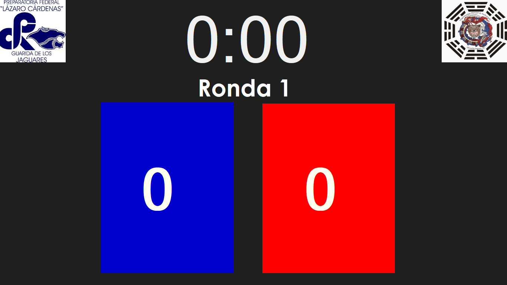
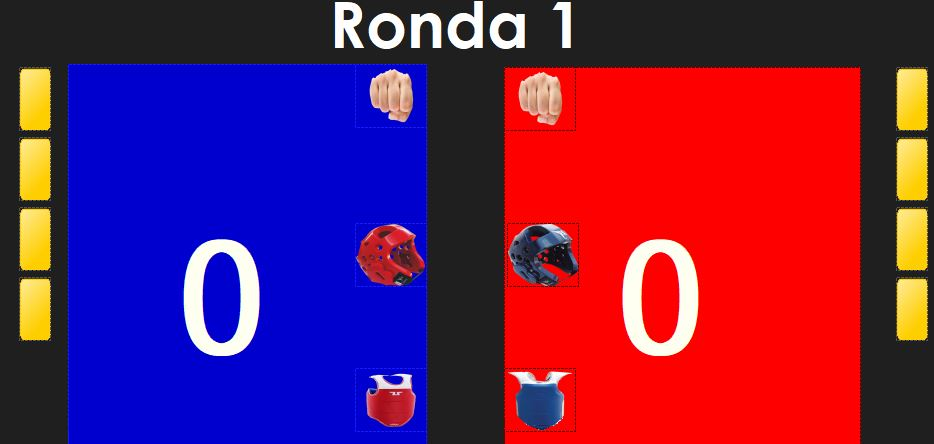

# kyorugi
###(Kyorugi significa Combate en koreano)

Este es un proyecto que hice para la escuela de taekwondo Dinastia jaguar en la Preparatoria Federal Lazaro Cardenas.

Tiene elementos ocultos que son las faltas que puede cometer un peleador en un combate.
Incluso agrege eventos para que al teclear los puntos se marque de que fue el punto obtenido; puño, peto o careta.

